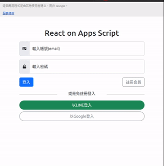

# ReactOnAppsScript

這個專案旨在使用Google Apps Script這個(免費)伺服器框架下，進行React網站的開發建置，並以Google Sheet作為簡易型資料庫，Google Drive作為內容儲存庫，讓網頁可以動態呈現並方便管理。

使用MIT協議釋出本專案，由於專案逐步建構中，若有建議歡迎提出。

## 最新資訊

2025-08-15 遷徙到Mirochiu/React-Google-Apps-Script 3.1.0版本

## Demo

## 各項功能說明(舊版)

建議搭配我寫的一系列文章：Apps Script用Sheet生成動態網頁，分別查看說明：

* [Apps Script用Sheet生成動態網頁(30): 套用Bootstrap 5浮動標籤](https://blog.mirochiu.page/2021/12/apps-scriptsheet30-bootstrap-5.html)
* [Apps Script用Sheet生成動態網頁(29): 表單input動態候選清單(auto-complete)](https://blog.mirochiu.page/2021/11/apps-scriptsheet29-inputauto-complete.html)
* [Apps Script用Sheet生成動態網頁(28): 整合Google登入](https://blog.mirochiu.page/2021/11/apps-scriptsheet28-google.html)
* [Apps Script用Sheet生成動態網頁(27): 整合LINE登入](https://blog.mirochiu.page/2021/11/apps-scriptsheet27-line.html)
* [Apps Script用Sheet生成動態網頁(26): 移植註冊會員及確認信](https://blog.mirochiu.page/2021/11/apps-scriptsheet26.html)

* [Apps Script用Sheet生成動態網頁(25): 登入才能使用的功能分項](https://blog.mirochiu.page/2021/11/apps-scriptsheet25.html)
* [Apps Script用Sheet生成動態網頁(24): 移植刪除HTML連結功能](https://blog.mirochiu.page/2021/11/apps-scriptsheet24-html.html)
* [Apps Script用Sheet生成動態網頁(23): 移植HTML連結列表](https://blog.mirochiu.page/2021/11/apps-scriptsheet23-html.html)
* [Apps Script用Sheet生成動態網頁(22): 移植上傳HTML功能](https://blog.mirochiu.page/2021/11/apps-scriptsheet22-html.html)
* [Apps Script用Sheet生成動態網頁(21): 移植會員登入頁面](https://blog.mirochiu.page/2021/11/apps-scriptsheet21.html)

## 使用本專案

### 第一次使用, 請先做以下項目

1. 先安裝`pnpm`, `jq`
1. `pnpm install` 安裝本專案相依套件
1. `pnpm run login`登入Apps Script

### 新Apps Script專案發布成Web App

1. `pnpm run setup`自動建立新的Apps Script專案
1. 到Apps Script網站中將建立好得Apps Script發布成Web App,可參考YT影片: [Apps Script作為Web App](https://www.youtube.com/watch?v=BlJXCdtwJdo)
1. 紀錄發布的`部署作業 ID`,在`dist/.clasp.json`中加入`deploymentId`鍵值來指定部屬ID
1. `pnpm run deploy`發布新版本,記下新發布版本號碼
1. `pnpm run open`選擇剛發布的版本號碼,瀏覽器上確認結果

### 使用既有發布成Web App的Apps Script專案

1. 移除`dist`目錄和`.clasp.json`檔案
1. `pnpm exec clasp clone --rootdir dist`選擇你要用的App Script
1. 拷貝`dist/.clasp.json`到本專案根目錄
1. 在`dist/.clasp.json`中加入`deploymentId`鍵值發布到`部署作業 ID`
1. `pnpm run deploy`發布新版本,記下新發布版本號碼
1. `pnpm run open`選擇剛發布的版本號碼,瀏覽器上確認結果
